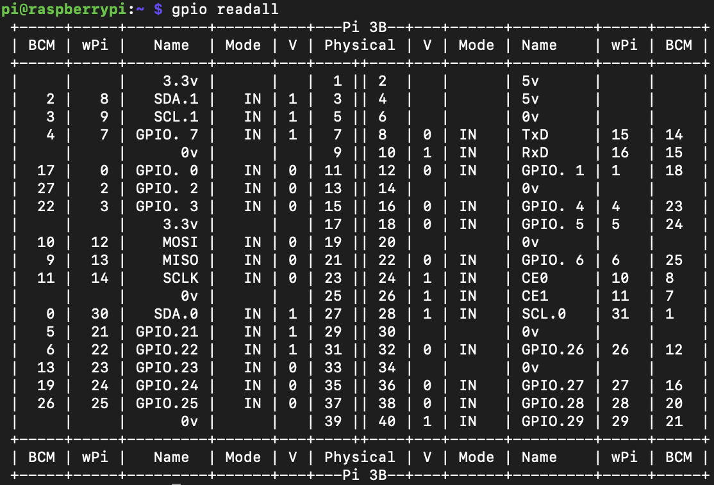
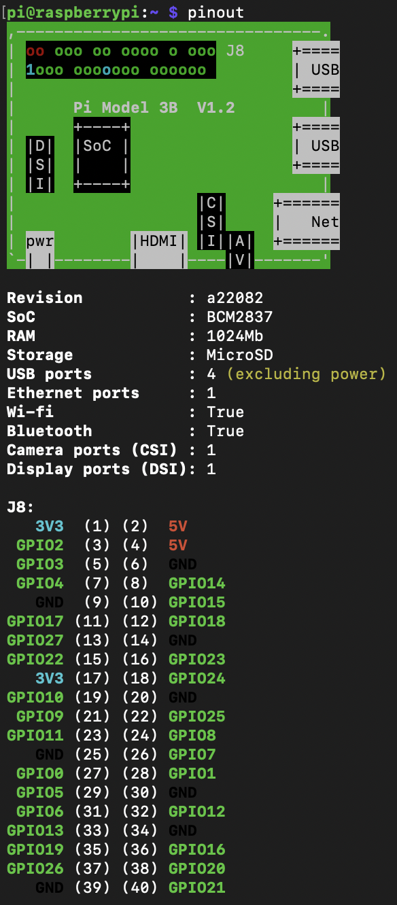

# Raspberry Pi Shutdown Button
Add a physical shutdown button to a Raspberry Pi. This is particularly useful for a Raspberry Pi running in headless mode with, since yanking out the power cord is not a safe option for shutdown. Choose from options implemented in different languages.

# Requirements
Hardware Requirements
- 1 Raspberry Pi 
- 1 normally-open momentary pushbutton switch
- 2 jumper wires with female connector (only need if not already attached to switch)

If you need to connect the pushbutton switch with the jumper wires, you will also need a soldering iron and solder.

Software Requirements
- For bye_pi.py: <br/>
  ```sudo apt install python3-gpiozero```
- For bye_pi.c and bye_pi.sh: <br/>
  ```sudo apt-get install wiringpi```

**NOTE:** The project was tested on a Raspberry Pi 3 Model B running the Raspbian Buster Lite OS.

# Hardware Setup
If the switch did not already come with jumper wires attached, solder two jumper wires to the switch. The two jumper wires should have female connectors on one end, so they can be attached to the GPIO pins on the Raspberry Pi. 


### GPIO Pins
There is more than one pin cominbation available for connecting the pushbutton switch. The code in this project uses physical pins 39 and 40, so unless you modify the code accordingly, stick with those pins. Keep in mind that the physical pin numbers are different from the BCM pin numbers, which are also different from the wiringPi pin numbers. The best way to visualize the relationship between the three different numbering systems is to use the `gpio readall` command. 



Additionally, the `pinout` command shows each pins' physical orientation on the board as well as other useful information.



# Software Setup (Choose One)
The setup instructions assume you have the script in your /home/pi directory, but if you have it elsewhere just provide the actual path to the file instead of /home/pi.

### bye_pi.py
Make the Python script executable. <br/>
```chmod +x bye_pi.py```

Place the script in rc.local so it runs at boot. To do so, edit the rc.local file: <br/>
```sudo nano /etc/rc.local``` <br/>
Add the following above `exit 0`: <br/>
```home/pi/bye_pi.py &``` <br/>

Alternatively, you could use cron instead of rc.local to schedule the script to run at boot.
```crontab -e``` <br/>
```@reboot /home/pi/bye_pi.py &``` <br/>

### bye_pi.c
Compile the C code to executable code. <br/>
```gcc -Wall bye_pi.c -o bye_pi -l wiringPi```

Place the program in rc.local so it runs as boot. To do so, edit the rc.local file: <br/>
```sudo nano /etc/rc.local``` <br/>
Add the following above `exit 0`: <br/>
```home/pi/bye_pi &``` <br/>

Alternatively, you could use cron instead of rc.local to schedule the script to run at boot. <br/>
```crontab -e``` <br/>
```@reboot /home/pi/bye_pi &``` <br/>

### bye_pi.sh
Make the bash script executable. <br/>
```chmod +x bye_pi.sh```

Place the script in rc.local so it runs at boot. To do so, edit the rc.local file: <br/>
```sudo nano /etc/rc.local``` <br/>
Add the following above `exit 0`: <br/>
```home/pi/bye_pi.sh &``` <br/>

Alternatively, you could use cron instead of rc.local to schedule the script to run at boot. <br/>
```crontab -e``` <br/>
```@reboot /home/pi/bye_pi.sh &``` <br/>

# Usage
Connect the pushbutton switch to the GPIO pins when the Raspberry Pi is powered off. Power on the Raspberry Pi. The script should already be running via rc.local or cron. Simply push the button to power off the Pi. 

# Similar Projects


